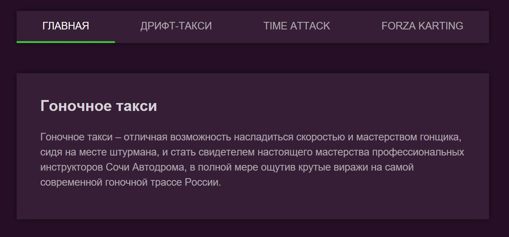

Навигационное меню
===

Необходимо реализовать меню для сайта гоночного такси с пунктами «Главная», «Дрифт-такси», «Time Attack» и «Forza Karting». При переходе на страницу соответствующий пункт меню должен подсветиться:  

